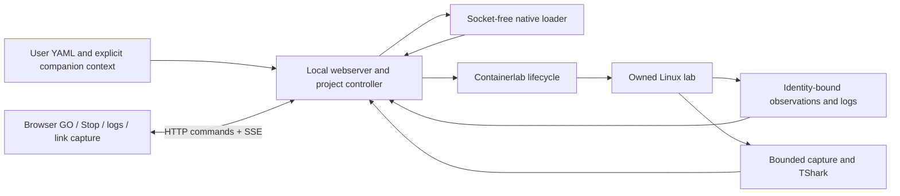

# A38 — Installed runtime resume and scoped recovery

**Observed:** fixture-free preview.10 is running at http://127.0.0.1:4173, outside the repository. Installed status reports a stopped VM without guest transport; start verifies a previously prepared local instance anchor and rechecks guest identity/native pins. GUI Resume / reconnect and Check recovery serialize with GO/Stop. An installed update-helper command updates only the verified owned runtime helper under its operation lock.

**Observed:** the authorized existing development lab passed native Stop, VM stop/status/start, offline GO refusal, recovery and GO. A second active-lab shutdown exposed exited containers with unchanged IDs: recovery now reports partial and requires explicit Stop/GO. Final native redeployment independently observed all eight nodes running. The failed identity-only assessment is preserved. No new VM or unrelated VM was used; the user lab remains running.

**Verification:** 30 TypeScript and 14 Python live checks pass; 85 regression checks and build/typecheck pass. Same-name replacement faults are mocked, not destructive trials on user resources. Fresh creation with alternate state directory, full mouse-driven cycling, installer transactions, signing and long soak remain unrun. See artifacts/implementation/LIVE-005/RESULTS.md, RUNNING.md and UX_ISSUES.md (workspace-relative).

**Next:** improve specific sanitized native deployment diagnostics, qualify an official Linux demo through capture, and finish normal installer/upgrade handling. No new serial, arbitrary Lua, persistent capture or universal corpus claim. TT-01, historical Q outcomes and the 177-case denominator remain unchanged. Recovery is scoped lifecycle evidence for B4/B6 and S-01/S-03/S-07, not application-health evidence.

## Prior published scope

# A37 — Installed capture feedback

**Observed:** preview.8 is running at http://127.0.0.1:4173. The link inspector now surfaces size-limited capture status, original-expiry save countdown and distinct empty/no-match/filter-rejected/analysis-unavailable explanations. Contract-based field guidance disables invalid submissions; packet rows scroll within a bounded region. Existing layout, native capture policy and server validation are unchanged.

**Observed:**25 TypeScript+9 Python checks and build/typecheck pass. Actual installed Safari capture displayed the size-limit warning and two filtered rows; no-match reanalysis retained the original PCAP and decreasing expiry. Invalid filename disabled Start with guidance. App-only replacement reconciled unchanged deployment and all eight container IDs; user lab remains running. No GO/Stop, native helper change or new VM. See artifacts/implementation/LIVE-004/RESULTS.md and RUNNING.md (workspace-relative).

**Next/limits:** continue hands-on presentation review and explicit runtime resume/recovery UX. Actual expiry waiting, broader browser matrix and native/corpus qualification were not rerun. Serial, arbitrary/VITA Lua, persistent/rotating PCAP and signed distribution remain outside this slice. TT-01, historical Q results and177 denominator unchanged.

## Prior published scope

# A36 — Offline GO preflight and installed recovery fix

**Observed:** interactive Safari review found that GO against a stopped VM incorrectly recorded partial deployment. Preview.7 now verifies owned runtime availability/native identity before deployment intent; offline failure preserves ready/stopped and permits retry with actionable guidance. Project files are rechecked after preflight. Failure after native mutation still remains partial. Approved layout is unchanged; stopped logs/capture guidance points to GO.

**Observed:**22 TypeScript+9 Python checks,85 regression tests and build/typecheck pass. Offline/concurrent/source-change cases are mocked; actual installed Safari GO, all eight node observations, logs and Follow pass after user-approved resume. The exact owner/project's prior false-partial state was privately backed up and repaired only after confirming empty native inventory and no deployment record. No VM was newly created, no qualification VM reused, no deployment identity adopted. The existing durable user runtime and preview.7 server remain running at http://127.0.0.1:4173.

See artifacts/implementation/LIVE-003/RESULTS.md and RUNNING.md (workspace-relative). Serial, automatic VM resume/recovery UX, project retirement, long-duration soak and signed distribution remain open. No new PCAP/official-demo/full-corpus claim. TT-01, historical Q statuses and177 denominator remain unchanged. Next: continue real-user presentation review, then implement explicit owned-runtime resume and recovery UX; do not bypass mismatched identities.

## Prior published scope

# A35 — Implemented installed interaction contract

The LIVE-002 results supersede A34's disabled-capture and port-blocked status below. The production package has no examples or recorded topologies. Actual installed native deployment/logs/capture/reanalysis are qualified for selected profiles; see LIVE-002/RESULTS.md. Serial remains disabled.

Link requests contain exact deployment/link identity and a basename, duration, snaplen, capture/display filters and optional reviewed Lua ID. Server resolution chooses one qualified Linux endpoint; provenance remains attached. Maximum one job/one MiB artifact/five-minute TTL/100 displayed rows. PCAP header and record bounds are checked. Cancel, identity change and expiry prevent publication/download; new selection clears prior UI state. Reanalysis uses the same bytes without extending retention. There is no arbitrary path/script/exec interface. Runtime calls use a four-waiter FIFO and preserve bounded helper execution.

Installed provisioning includes pinned TShark and isolated analysis root; image import and runtime status/stop are fixed identity-checked commands. Original YAML/companions and image archives are user inputs outside the app. Fresh runtime configuration uses guestIP0.0.0.0, guestIPMustBeZero false, proto any, ignore true to block automatic forwarding. Docker logs rotate10MiB×3. Eight project snapshots,50GiB disk; deletion/resume/long-term retention remain explicit follow-ups. See packaging/README-LIVE.md and LIVE_DEPENDENCIES.md for commands and dependency limits.

## Historical A34 baseline and target rationale

# A34 — Live application core; installed acceptance remains incomplete

**User direction:** launch a supplied YAML project, use GO for native deployment, and interact with a live lab. The installed production entry contains no topology examples or recorded graphs. Four-radio and pinned official demos are external acceptance inputs, never production constants. This supersedes historical example-bundle and endpoint-picker directives below.

**Observed:** explicit source inventory, native loading, GO/Stop, container/interface enrollment, bounded node logs and application restart passed on a newly created disposable Linux runtime. The approved revision-2 bottom Logs / Serial pane is implemented. Four official demos and the unchanged eight-node four-radio project passed native declaration checks. See `artifacts/implementation/LIVE-001/RESULTS.md` (workspace-relative) for stage-specific evidence.

**Partial:** the fixture-free 0.3.0-preview.1 candidate builds and external-directory doctor runs, but installed browser acceptance and fresh installed-runtime provisioning are not qualified. Capture/reanalysis/Lua and serial are disabled in this production path. Port 4173 remains occupied by the user's preview; it was not terminated. No persistent user lab has been created. The qualification VM is stopped and its synthetic lab removed.

**Next:** integrate exact-link capture/reanalysis, qualify installed provisioning and image acquisition, then execute the 11 installed acceptance steps against selected official demos and full four-radio. Keep TT-01, historical Q outcomes, the 177-case denominator, native authority and no pre-existing VM access. The A33 user-rebuild hash drift is preserved explicitly in LIVE-001/baseline.json and the predecessor archive.

## Target contracts and dependency plan

# Live installed application — proposed A34 target

**Documented/current:** React Flow rendering, native declaration projection, identity-bound observation, bounded logs and isolated capture/reanalysis exist. Catalog-based inputs, prerecorded frontend imports, experiment-only session validation and external deployment scripts prevent the desired installed workflow. A33 packaging proved portability, not deployment. See baseline.json for one preserved user-rebuild drift.

**Designed target:** user path → local project inventory → isolated native declaration loader → graph DTO → browser. GO → lifecycle controller → Containerlab in an owned Linux runtime → native enrollment → periodic bounded observation → SSE snapshots. Node logs and link capture use that same exact enrollment. Browser never receives a daemon socket or unrestricted native output. No database/broker is needed.



## Contracts

Project/1: launch path selects a single entry file; optional explicit companion paths are relative to its parent. No recursive directory copy, YAML reimplementation, automatic hook execution or remote fetching during load. Regular files only; reject symlink components, traversal, outside-root paths, special files, duplicates and oversize inputs. Hash exact bytes; snapshot selected files in memory and recheck before deployment. Missing context remains a native diagnostic. Environment/template context must be explicit; ambient process secrets are not inherited. Inventory is shown before GO. Internal legacy bundle IDs may identify content but never select packaged examples.

Lifecycle/1: no-project → loading → ready/not-deployed → deploying → running or partial/failed → stopping → stopped. Disconnected is distinct from destroyed. One mutation per owned project/runtime; duplicate GO refused. Persist ownership and operation intent before mutation. Match project hash, lab identity and full native IDs; same-name replacements require explicit re-enrollment. Before deploy, refuse an existing lab collision. Cancellation is bounded and cannot claim rollback completed unless cleanup is observed. Browser close never tears down the lab. Application restart reconciles intent and exact identities before enabling actions.

Events/1: SSE provides full current snapshots with monotonic generation/sequence, observation timestamps and freshness. Five-second bounded native polling initially; no observation overlap. On reconnect send full state, discard prior generation, cap each client queue and disconnect slow clients. Error/stale snapshots never become fresh healthy state. Browser selections clear on project/deployment change. Node/container readiness is not application health.

Capture link/1: request carries deployment ID + selected link ID and filename/settings; no user endpoint picker. For a qualified two-ended veth link, resolve a deterministic supported Linux endpoint using server-side native identity/namespace evidence, capture both directions there once, and retain chosen capture-point provenance internally. Parallel occurrences stay distinct. Other shapes/ambiguous associations are explicitly unavailable; never combine both ends silently. Reuse duration/bytes/snaplen/filter bounds. Store expiring artifacts with actual validated download filename; no arbitrary path writes or overwrite. Rotation/persistent retention unavailable until implemented. TShark reanalysis preserves original bytes/hash; only reviewed Lua IDs.

Runtime ownership: installed state outside app directory, owned immutable runtime ID/name/config/tool hashes; no experiment prefix or short lease. User-interaction runtime stays running until explicit stop. Qualification VM is fresh and stopped afterward. No old VM adoption. Mac loopback4173; no host mounts, forwarded agent or public ingress. Define quotas before live deployment. GUI removal cannot remove lab state.

## Dependencies

Mac app: bundled upstream Node26.8.1, built React19.2.8/React Flow12.10.2, Zod4.6.5; macOS ARM64 and browser. Host: Lima2.2.0/VZ. Linux: pinned Ubuntu image, Docker, Containerlab0.79.0 commit5ae50094a3afd70e4e1674fe5385e64d8979da26, compiled native declaration worker, Python3, bubblewrap, systemd, util-linux/nsenter, iproute2, coreutils/timeout, TShark/dumpcap and analysis-root shared libraries. Existing package lock controls JS closure; runtime APT/image closures must be inventoried during build. Go/C++/npm are build-only. Four-radio app image acquisition/build and pinned SR Linux image are separate user/test resources, never app payload. Signing/notarization remain unresolved; pkgbuild permission stderr needs investigation separate from payload validation.

## Dependency-ordered implementation and acceptance

1. Pure project inventory and link-target contracts with independent negative tests; extract reusable native projection from catalog loading.
2. Fixture-free production entry/server and package; empty-start and no-recording byte/content tests. Keep evidence UI exclusively in developer build.
3. Installed runtime artifact/bootstrap and owned lifecycle, then user-path native load. No repository/sibling requirement at launch.
4. GO/Stop native enrollment, SSE/reconnect, logs and link-level capture with actual artifacts.
5. Fresh installed runtime testing against pinned official demos plus unchanged four-radio source. Stage-level loading/rendering/deployment/observation/log/capture results; do not alter177 denominator. Broader unsupported demos remain inventoried.
6. Persistent user environment and interactive review after actual workflow acceptance. Material GUI changes require explicit approval; continue backend work while pending.

Independent acceptance: no packaged topology data; exact original file hashes; no symlink/traversal/implicit directory upload; late/changed identity refusal; serialized lifecycle; offline/reconnect states; literal hostile text; occupied port; no endpoint selector; filename corresponds to downloaded PCAP; unchanged bytes on reanalysis; clean native Stop. Installed execution from unrelated CWD with no developer tools or repository. Native loading and live demo tests cannot be replaced with mocks.

## Current qualification

# LIVE-001 — Live application core; installed acceptance incomplete

**Observed:** the production entry is now `apps/live`, built with `npm run build:live`.
It imports no fixture catalogs or prerecorded graphs. The approved revision-2 layout
places Logs / Serial console beneath the graph and link settings in the right inspector.
Approval and exact reviewed image hashes are in `layout-approval.json`.

**Observed implementation:** explicit byte-preserving project/companion inventory;
socket-free pinned native loading; serialized native GO/Stop; exact container enrollment;
native interface observation; bounded node logs; SSE full snapshots; project hash checks;
application restart reconciliation; and refusal to adopt replacement container IDs.
The production CLI accepts a topology path and explicit `--include` companions.
Native generated output uses `CLAB_LABDIR_BASE`, separate from the original input inventory.

## Actual evidence

- `live-tests.log`: 14 TypeScript boundary/contract tests and 9 Python helper tests pass.
- `regression.log`: 85 existing tests pass.
- `live-build.log`: typecheck and fixture-free production build pass. React Flow's existing
  `use client` bundler warning remains; no chunk-size warning in this entry.
- `browser-results.json`: six mocked-browser checks pass, including selected-node output,
  clearing on node change, hostile log text, serial unavailable, link form without endpoint
  picker and no recorded-topology chooser. These are **not** installed/live E2E results.
- `lifecycle-runtime.json`: actual native loading, deployment, both interfaces, real log tail,
  application restart with unchanged identity, and native cleanup pass on two synthetic
  Linux nodes in the newly created VM. No claim of continuous application health.
- `demo-results.json`: C042, C043, C023, C002 original pinned official demos pass native
  loading and individually specified node-kind / endpoint-pair expectations. Their
  deployment, observation, capture and installed-browser stages remain NOT_RUN.
- `four-radio-results.json`: unchanged user YAML plus seven explicitly inventoried companion
  files loads as eight native nodes / seven specific links. Image acquisition, deployment
  and installed-browser workflow remain NOT_RUN.
- `package-verification.json`: candidate archive manifest, absence of fixtures, external-CWD
  doctor and pkg expansion. Apple Installer transaction/signing/notarization NOT_RUN.

## Failed attempts retained

`lifecycle-runtime-attempt1.*`: deployment passed but native output in the input directory
caused `UNDECLARED_BUNDLE_FILE` during logs and Stop. Exact identities were checked before
manual native cleanup (`lifecycle-attempt1-cleanup.log`). Containerlab's supported
`CLAB_LABDIR_BASE` fixes that separation; attempts 2 and 3 passed.

`live-tests-attempt1.log`: HTTP test incorrectly assumed Node fetch preserved a custom Host
header. Switched the test transport to Node HTTP request; origin expectations unchanged.
`contracts-attempt1.log` retains the earlier unsupported TypeScript parameter-property
failure. No expectations were weakened to make these checks pass.

## Not complete / next executable work

1. Connect the qualified link capture / PCAP download / TShark reanalysis mechanisms to this
   owned-runtime path using exact native link binding. Current production capture button is
   deliberately disabled. Reviewed Lua and serial transports are not enabled in this path.
2. Qualify explicit fresh-runtime creation from the installed candidate, dependency closure,
   image acquisition, local VRT image loading and durable runtime lifecycle controls.
   The new creator exists but has **not** been exercised from the installed package.
3. Complete selected official-demo and full four-radio deployment + all 11 installed E2E
   steps. Port 4173 was occupied by the user's existing preview; it was not terminated.
4. Qualify runtime disconnection/cancellation/fault recovery, privacy/retention, package
   upgrade/uninstall behavior and pkgbuild's unresolved `write: Permission denied` diagnostics.
   Successful expansion does not explain those diagnostics or prove Installer acceptance.

Do not treat this candidate as the finished requested installed product. A34 publication
records these limitations; historical Q outcomes and the 177-case denominator are unchanged.

## Reproduction / cleanup

Ordinary checks (create no VM):

```sh
npm run test:live
npm test
npm run build:live
node tests/live/browser.mjs
python3 packaging/build-live.py
```

The build requires the hash-verified official Node archive under `.runtime-release` and
pinned native binaries under `.runtime-live-build`; these are build inputs, not runtime
repository dependencies. See `packaging/LIVE_DEPENDENCIES.md`.

Candidate: `../containerlab-releases/0.3.0-preview.1`. Its doctor runs independently of the
repository. Do not invoke runtime creation as a substitute for the pending qualification.
No new persistent user lab was created. The synthetic lab was destroyed; the task-created
`clab-app-build-20260926-153645` VM is **Stopped** (`vm-final-status.txt`), with no remaining
containers (`remaining-containers.txt`). The existing preview and all pre-existing VMs
were left untouched. Future qualification must create another fresh dedicated VM.
