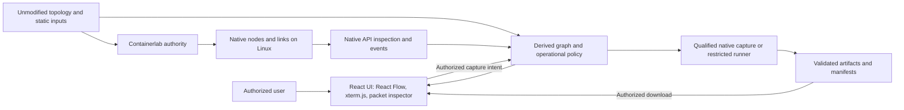
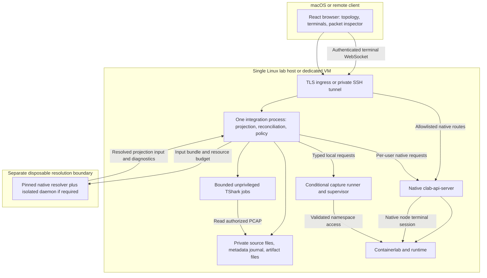
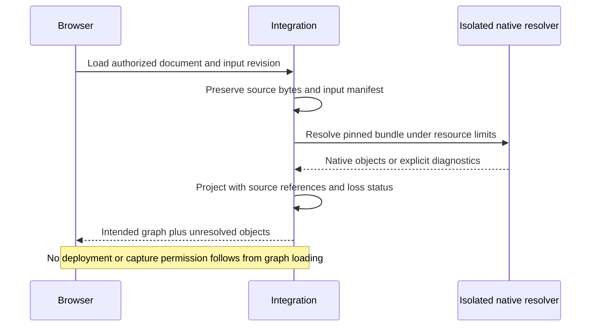
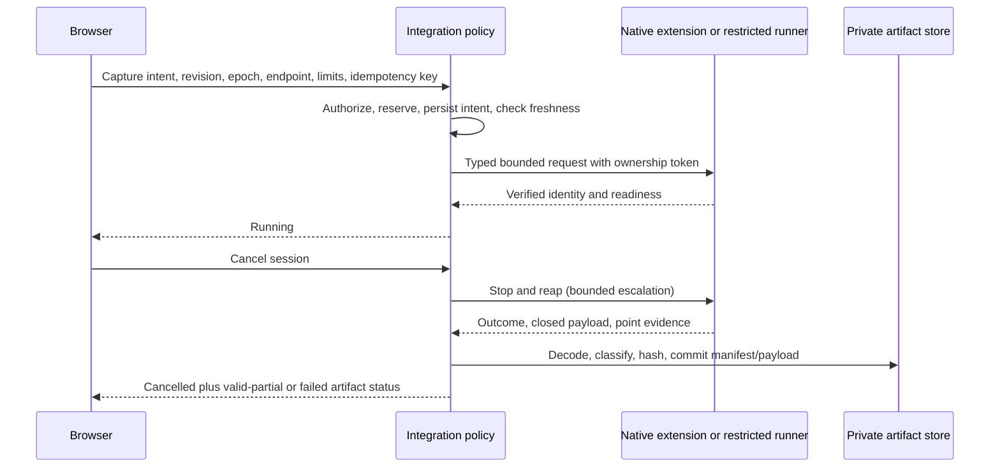

# Containerlab visualization and capture architecture

Architecture revision A2 · evidence baseline: qualification run 03 · **proposed, not implemented**.

**Inferred recommendation:** retain native Containerlab topology and lifecycle; use a React client with a read-only React Flow topology view, separately authorized xterm.js node terminals and TShark-backed packet inspection with one Linux integration process for source provenance, graph projection, observation reconciliation and artifact policy. Reuse native authentication/inspection/capture facilities wherever their contracts satisfy the gates. Isolate native resolution from the operational host. Add a restricted capture runner only if an upstream extension cannot meet freshness, limits and recovery requirements. These are logical responsibilities, not a prescribed fleet of services.

Version alignment, complete export/provenance and capture ownership/recovery are conditional decisions. [Decision records](DECISIONS.md), [traceability](TRACEABILITY.md) and [implementation handoff](IMPLEMENTATION_PLAN.md) define their alternatives and closure tests. The [previous proposal](history/pre-architecture-phase/ARCHITECTURE.md) is preserved as historical text; conflicting statements there are superseded here.

## 1. Evidence and scope

**Observed, F-022–F-027:** qualification demonstrated inherited native configuration and aliases, template expansion, API lifecycle/ownership/inspection, a supported GUI graph, Linux-veth capture controls/faults/concurrency, Packetflix streaming/VNC readiness and one SR Linux alias/port inspection. Resolution retrieved an HTTP startup configuration; a VNC capture survived API restart without a retrievable session; quota exhaustion corrupted a PCAP despite exit 0. [Qualification report](../../QUALIFICATION.md), [loss ledger](../qualification/LOSS_LEDGER.md), [capture failure](../qualification/capture-results.json), [restart evidence](../qualification/api-post-restart.json).

**Documented version boundaries:** resolver/CLI v0.79.0 at `5ae50094a3afd70e4e1674fe5385e64d8979da26`; tested API v0.6.0 at `bdbd2ecb97033b6ee65d580c968aee7ee90f15ff` embeds **v0.78.0**. Tested GUI v0.2.2 at `31727ea16c915004319cfe70cdec3e1032ad68a9` locks clab-ui 0.3.1 with XYFlow. These are separate evidence profiles, not an accepted combined production stack. [Source index](../sources.csv), [reuse matrix](../qualification/REUSE_MATRIX.md).

**Observed corpus:** 435 candidates, 177 included, 258 excluded; 123 native validation PASS/54 FAIL; 177 semantic projection/render PARTIAL; 0 complete static passes. Every corpus runtime stage remains NOT_RUN. Synthetic lab results do not change those rows. [Manifest](../corpus/manifest.csv), [stage results](../compatibility/results.csv).

**Inferred/proposed scope:** all native kinds remain representable, with unknown/unresolved attributes recoverable from authorized source. Initial operational qualification targets Linux/Docker veth capture and the demonstrated SRL inspection path. Other NOS, guests, Podman, shared/tunnel links and dense/live graph performance remain explicit gates. Static universal acceptance is still required; a limited preview cannot satisfy it. No topology editor, custom switching, competing DSL or deployment engine is proposed. Native topology-defined OVS/OVN nodes remain legitimate inputs.

All design statements below are **Inferred/proposed** unless explicitly marked Observed, Documented or Unresolved. They are acceptance obligations, not implemented guarantees.

## 2. Context and deployment





The browser has no runtime socket, arbitrary namespace access or privileged credentials. The native API retains its existing privilege requirements; placing an unprivileged integration process in front does not make the API least-privileged. Allowlist exposed native operations to topology inspection and separately authorized node-terminal sessions; deployment remains native and can be invoked through existing authorized tooling. Do not add duplicate lifecycle routes.

The integration process holds no raw passwords and obtains authenticated identity through a qualified native authentication bridge (D-04). Proxying is permitted only with the user's native credentials/session, not an unrestricted administrative identity. Authorization failure or inability to verify identity disables the operation. Do not expose Edgeshark discovery/capture ports directly to an untrusted browser; a scoped authenticated transport is a prerequisite for enabling live capture beyond private experiments.

The resolver receives immutable copied inputs, a private writable scratch area and default-denied outbound access. Its daemon, if required, belongs inside the disposable boundary: a supposedly read-only mount of a privileged operational Docker socket is not isolation. Native resolution may have effects even without Deploy. Do not rewrite topology paths silently; preserve bundle-relative layout and record unsupported absolute/context-dependent dependencies as diagnostics. A reviewed, pinned download can be staged explicitly; the resolver cannot fetch arbitrary dependencies on the operational host. Full isolation feasibility remains D-02/B2, not a measured guarantee.

## 3. Responsibilities and state

| Responsibility | Placement and reuse | Why it exists / boundary |
|---|---|---|
| Topology semantics and lifecycle | Native Containerlab, selected aligned version profile | Sole authority; no custom default merging, alias conversion, Go-template evaluator or network rewiring |
| Authentication and lab ownership | Native API/auth integration | Reuse tested PAM/JWT/ownership paths; added routes must inherit verified identity and reauthorize, not trust a client username |
| Source/provenance and graph | Modules in one integration process | Original bytes and native objects are distinct; React Flow needs a projection and diagnostics |
| Runtime observation | Same process, native inspect/events inputs | Events lack a qualified atomic cursor; explicit freshness and resync needed |
| Capture/artifact policy | Same process, conditional upstream extension first | Authorization, quotas, durable session ownership and artifact acceptance are gaps, not a second deployment service |
| Privileged capture execution | Upstream facility if qualified; otherwise one narrow local runner | Bounded child/cgroup, validated namespace/interface, fixed argv; no shell/program/path supplied by client |
| Durable metadata | Initially one local transactional journal, proposed SQLite | Atomic reservation/idempotency/recovery records; no separate database server or broker justified by current scale evidence |
| Payload storage | Private local files on quota-controlled storage | Source bundles and PCAPs require access control, size limits and atomic publication; no object-storage service needed initially |

If upstream capture gains durable ownership and artifacts, reuse that storage rather than create parallel session truth. The journal proposal is conditional on D-06/D-07. Store source revision/input hashes, ownership references, authorization audit, mapping observations, session lifecycle, runner ownership token and artifact manifest. Do not store native passwords, unrestricted runtime credentials or raw captures in logs. Cache graph and runtime observations separately; rebuild derived graphs from source/native inputs.

Single-host/single-writer operation is the initial assumption. Multi-host and high availability would require revisiting fencing, identity and storage; they are not implied by this design. On disk exhaustion refuse new reservations, retain terminal diagnostics where possible and stop bounded children; journal capacity and artifact quota need separate headroom.

## 4. Source and graph contract

| Field/concept | Proposed meaning |
|---|---|
| `documentId` | Opaque identifier for an authorized source location; not a filesystem path from the browser |
| `revision` | Hash of original bytes, input manifest and resolver profile; excludes synthesized MACs and runtime timestamps |
| `inputManifest` | Original locations, relative paths, hashes, template vars/includes and explicit missing dependencies; secret values stay private |
| `resolution` | Complete/partial/rejected, diagnostics, resolver pin, source/native references and loss ledger; successful validation alone is insufficient |
| `objectId` | Revision-scoped node key or source link occurrence; parallel links remain distinct |
| `origin` | Source file/hash/pointer or template input reference, with origin status known/unresolved; do not infer exact inherited origin by duplicating native semantics |
| `attributes` | Authorized projection of source and native values with explicit differences; sensitive values referenced/redacted rather than broadcast |
| `logicalRole` / `nativeType` | Separate source semantics from native mechanism, e.g. management attachment versus veth |
| `endpoint` | Source token, native alias, normalized name, native endpoint object and separately observed runtime mapping |
| `capability` | Supported/unsupported/unresolved/stale/denied, reason, version scope and evidence/observation age |

A revision-scoped ID is deterministic within the same input bundle. Array reorder or template expansion changes can invalidate cross-revision link identity. Do not inject GUI IDs into YAML or merge indistinguishable parallel occurrences. Preserve an unresolved template source reference when native output lacks expansion coordinates. Generated MACs remain native output, never a source identity key ([repeat experiment](../qualification/resolution-repeat.json)).

Example **proposed graph fragment**, not a native API response:

```json
{
  "contract": "proposed/1",
  "documentId": "doc-42",
  "revision": "sha256:input-bundle-and-resolver-profile",
  "resolution": "partial",
  "link": {
    "id": "revision/link/0",
    "sourceRef": {"pointer": "/topology/links/0", "origin": "known"},
    "logicalRole": "point-to-point",
    "nativeType": "veth",
    "endpoints": [
      {"node": "srl", "sourceToken": "ethernet-1/1", "nativeAlias": "ethernet-1/1", "normalizedName": "e1-1"},
      {"node": "peer", "sourceToken": "eth1", "normalizedName": "eth1"}
    ],
    "capture": {"status": "unresolved", "reason": "NOS_CAPTURE_NOT_QUALIFIED"}
  }
}
```

Keep disconnected nodes, parallel links and native component membership. A native bridge node remains a node; host interfaces, management segments and remote tunnel termination are explicitly derived/external entities. A dummy endpoint cannot imply a reachable peer; a tunnel's destination metadata is not proof of guest connectivity. Unresolved source-backed pairs may render with diagnostics but must not masquerade as native-resolved connectivity.

Node/edge inspectors show source, native and observed values in separate sections, with origin and capability reasons. Use selection/panels for dense endpoint labels; count retention and a successful canvas load cannot qualify readability or attributes ([visual QA](../qualification/render/VISUAL_QA.md)). Source remains available when resolution fails, under source authorization; no proprietary image/license is required simply to include/display a source case.



## 5. Observations, identity and consistency

Reuse native inspect/interfaces and NDJSON events. **Observed:** `initialState=true` supplied snapshots; tested events exposed timestamps/actor identity, not a qualified atomic cursor ([events](../qualification/events-snapshot-initial.ndjson)). Do not fabricate native ordering by sorting timestamps.

Proposed reconciliation: subscribe/buffer native events, collect inspect/interface snapshots, reconcile buffered events as hints, and inspect changed objects again. Publish an observation version with collection interval and freshness status. If a boundary cannot be reconciled, publish uncertain/stale state, not an atomic snapshot claim. Bound the queue; overflow, reconnect, server restart or authentication loss invalidates freshness and triggers full reconciliation. Periodic inspection covers missed events even without an explicit gap signal. Coalesce counters only; reconcile lifecycle/session state independently.

`observationEpoch` is a local host/application epoch changed on boot, process restart, detected deployment change or loss of continuity. `sequence` orders only this integration process's published observations; it is not a native event cursor. Keep source `revision`, per-lab deployment identity and observation epoch separate. A disconnected browser receives a fresh snapshot; durable event replay and a message broker are unnecessary initially.

```mermaid
sequenceDiagram
  participant Native as Native API and runtime
  participant App as Integration
  participant UI as Browser
  Native-->>App: Event disconnect or redeploy evidence
  App->>App: Invalidate mapping and change observation epoch
  App-->>UI: Stale state; capture unavailable
  App->>Native: Reconnect events and collect fresh inspection
  Native-->>App: Snapshot and interface identities
  App->>App: Reconcile buffered hints and inspect changes again
  App-->>UI: New snapshot with freshness and capabilities
  Note over App,UI: Uncertain collection interval stays explicit
```

A capture point binds lab ownership, source revision, native node/container ID and started-at, host boot ID, namespace handle/inode, interface name/index and qualified peer evidence. Revalidate authorization and identities immediately before capture opening; hold namespace handles during execution where feasible. Namespace inode reuse, container name reuse and interface index reuse are not proof of continuity (F-009/F-027).

**Unresolved:** an external native CLI or administrator can mutate a lab between validation and opening a capture. A local sequence alone does not close this race. D-06 requires a native lifecycle fence or demonstrated equivalent binding/revalidation and invalidation behavior. For cooperating callers a per-lab operation fence may serialize capture admission with native lifecycle requests without replacing their execution. Out-of-band mutations require detection and termination; never promise global atomicity across uncooperative changes. If the agreed freshness guarantee cannot be demonstrated, keep operational capture disabled.

## 6. Capture lifecycle and artifacts

State proposal: `requested → reserved → resolving → starting → running → stopping → finalizing → complete`. Explicit terminal alternatives are `cancelled`, `invalidated`, `interrupted`, `failed`, and `failed-corrupt`. Session outcome and artifact validity are separate fields; a cancelled session may contain a valid partial artifact.

1. Verify native identity and current lab/target ownership. Resolve only server-known edge/endpoint IDs; forbid browser-supplied namespace paths, arbitrary host interfaces, output paths or shell strings.
2. Atomically reserve per-user/global slots and private storage budget; persist idempotency key and request hash before spawning. Same key/body returns the prior request; a different body conflicts.
3. Resolve and revalidate the point under the qualified freshness mechanism. Validate BPF using tool compilation and fixed argv. Restrict shared/guest points until their visibility is qualified.
4. Persist ownership token and supervisor unit/child identity before exposing readiness. Runner enforces duration, packet and storage limits independently of client connection or integration-process survival. If supervisor ownership and journal cannot be reconciled, do not start.
5. Expose ready only after capture readiness is observed. Cancel with graceful stop, bounded escalation and confirmed reap. Record requested stop reason separately from exit/signal.
6. Close files; independently decode, inspect truncation, verify limit/provenance records and hash. Publish only after manifest and payload are durable, using an atomic rename on the same filesystem and a recoverable journal transition.



| Condition | Required interpretation |
|---|---|
| Expected duration/packet limit, clean close, decoder success, valid provenance | Complete, with stop reason and counters; zero packets can be a valid empty capture |
| User cancellation with decodable closed output | Cancelled; optional valid partial artifact, not an unqualified complete result |
| SIGKILL, service crash or mapping invalidation | Interrupted/invalidated, even if the decoder succeeds |
| Quota/write failure or truncated decode | Failed/failed-corrupt, even with process exit 0; no successful artifact publication |
| Hash matches transferred file | Byte integrity only; does not prove correct point, complete session or decodable payload |

Enforce total storage including rotated files and temporary outputs. Ring rotation is a retention policy, not a strict stop-at-byte promise. A strict byte-stop requirement needs a separately qualified writer/tool path; until then expose only measured bounds. Proposed initial policy: 30-second duration, 256-byte snaplen, 10 MiB per-session storage, two sessions per user and four per host, 24-hour retention. These are tunable policy candidates, not observed capacity or precision guarantees; B6/B7 must establish enforcement and disk headroom before adoption.

Store format, tool/image/resolver pins, original source revision, target identities, BPF/direction, requested/effective limits, readiness/start/stop times, exit/signal/reason, decoded counts, retained bytes, checksum and authorization owner in the manifest. Capture one endpoint by default; two-ended capture needs duplicate/provenance handling. Offload, encapsulation and guest dataplane visibility remain capability limits.

### Crash recovery and access

```mermaid
sequenceDiagram
  participant App as Restarting integration
  participant Journal as Durable session journal
  participant Supervisor as Runner supervisor/native sessions
  App->>Journal: Read nonterminal intents and ownership tokens
  App->>Supervisor: Inventory only service-owned children
  Supervisor-->>App: Exact child/unit/session identities
  App->>App: Match intent, ownership and deadline
  alt Verified owned survivor
    App->>Supervisor: Stop/reap by default; retain interrupted evidence
    App->>Journal: Persist terminal state after validation
  else Missing child or mismatched ownership
    App->>Journal: Mark interrupted/uncertain; block affected admission
    Note over App,Supervisor: Never kill an arbitrary name/PID match
  end
  App->>App: Reconcile storage reservations and permit admission
```

Supervisor-enforced deadlines must survive integration failure; restart scanning alone is insufficient if the process never restarts. Prefer terminating verified survivors rather than resuming capture across lost authority. For native VNC/Packetflix, do not enable unattended sessions until native durable ownership/cleanup or an equivalent narrow extension is qualified. Extending TTL does not repair lost session lookup. Closing a live browser transport and ending its capture are separate operations; require a bounded disconnect lease policy and verify actual cleanup. A supervisor cannot safely recover native children whose ownership is not provable.

Downloads use opaque artifact IDs, verified user identity, current lab permission and session/artifact ownership on every request. Source-read rights do not automatically grant capture rights. Range downloads bind to an immutable checksum/ETag; interrupted transport is a client download state, not a change to the stored artifact. Revocation blocks new requests and cancels active transfers under the selected policy; this behavior needs testing. Expiry/delete persist a tombstone, deny further reads, remove payload and release quota, then reconcile incomplete deletions after restart. Deny new capture on recovery uncertainty or storage failure.

## 7. Interface boundary

**Documented/Observed native reuse:** `/login`; `/api/v1/labs` and native lifecycle; `/api/v1/labs/{lab}/interfaces`; topology source routes; `/api/v1/events?initialState=true`; Packetflix and Wireshark VNC session routes. Exact tested behavior/version is in [API evidence](../qualification/api-results.json) and [lifecycle evidence](../qualification/api-lifecycle.json). Native errors may include 500 for invalid input; preserve upstream status/correlation rather than claim a new validation guarantee.

The following **proposed extension contract** is separate from native routes. Names are illustrative; settle the identity/ownership bridge before route implementation.

| Operation | Contract |
|---|---|
| `GET /integration/labs/{id}/graph` | Authorized source revision, intended graph, resolution diagnostics, observation epoch/sequence/freshness and capabilities |
| `GET /integration/labs/{id}/objects/{id}` | Authorized source/native/observed inspector values; sensitive attributes filtered |
| `GET /integration/labs/{id}/updates` | Initially snapshot polling with ETag; optional SSE for invalidation/session notifications after B5, always resync on reconnect |
| `POST /integration/labs/{id}/captures` | Opaque endpoint, expected revision/epoch/observation version, bounded limits, filter and idempotency key; accepted means reserved, not ready |
| `GET /integration/captures/{id}` | Owned session state, observed readiness, effective limits and artifact validity |
| `DELETE /integration/captures/{id}` | Idempotent cancellation request; terminal result only after confirmed stop/finalization |
| `GET /integration/artifacts/{id}` | Reauthorized immutable download with size/type/checksum/ETag and qualified range semantics |
| `DELETE /integration/artifacts/{id}` | Authorized deletion/tombstone with active-read behavior specified |

For graph observations, prefer request/response plus polling first; no custom graph WebSocket protocol or replay infrastructure is justified by current measurements. Interactive terminals separately reuse the native bidirectional WebSocket transport after qualification. Native NDJSON is an input stream, not this extension protocol. Suggested extension errors: 401 unauthenticated, 403 denied, 404 absent/concealed resource, 409 stale revision/identity or idempotency conflict, 422 unresolved/unsupported point or invalid filter, 429 concurrency/storage reservation quota, 503 unavailable runtime/recovery. Define non-disclosing responses consistently with native ownership tests. An error response never silently switches interface or weakens requested bounds.


## A2 frontend and packet-analysis change

**User-selected requirement:** React for the application, React Flow for topology visualization, xterm.js for node terminals, and TShark for packet analysis feeding React views. This supersedes the Cytoscape constraint in the original brief and A1, preserved in [the A1 archive](history/A1/ARCHITECTURE.md). Topology editing remains out of scope; interactive terminals can change node configuration and therefore have a distinct permission. The application as a whole is no longer described as read-only.

**Documented:** the pinned upstream GUI already declares React, xterm.js and React Flow/XYFlow dependencies ([package lock](https://github.com/srl-labs/containerlab-app/blob/31727ea16c915004319cfe70cdec3e1032ad68a9/package-lock.json)). The pinned API exposes node terminal creation, session retrieval/deletion and a WebSocket stream ([routes](https://github.com/srl-labs/clab-api-server/blob/bdbd2ecb97033b6ee65d580c968aee7ee90f15ff/internal/api/routes.go)). These are source findings, not terminal runtime qualification.

**Inferred recommendation:** evaluate adopting/extending that upstream frontend before building a new React application. The old renderer exclusion is removed; full semantic fidelity, source preservation, permissions and supported extension boundaries still determine fit. Avoid a fork unless specific unmet requirements justify its maintenance. Keep graph/analysis/policy contracts independent of upstream UI internals. Select exact frontend/TShark versions during qualification; the historical lock is evidence, not automatic approval of a new production stack.

### React Flow projection

Map native nodes to React Flow custom nodes and each visualized interface to an explicitly identified handle. Edge occurrence IDs and source/target handle IDs refer back to semantic endpoint IDs; renderer positions, handles and selection never become topology authority. Source/target attachment does not make a bidirectional network link semantically directed. Preserve parallel occurrences, special endpoints, component membership and disconnected nodes. Disable connection creation/reconnection and topology edits; layout movement is view state only.

The source/native/runtime inspectors remain React panels. Qualify layout integration, dense labels, selection, accessibility, updates and 10/50/100/500-node workloads on React Flow. **Historical evidence:** the 177-case Cytoscape rendering results stay unchanged but do not qualify this renderer. A corpus-wide React Flow run is NOT_RUN; the previously observed small upstream GUI graph is only representative evidence. Native validation and capture results retain their original scope.

### xterm.js node terminals

Reuse native `POST /api/v1/labs/{lab}/nodes/{node}/terminal-sessions`, session GET/DELETE and `/api/v1/terminal-sessions/{sessionId}/stream` WebSocket rather than inventing a PTY service. xterm.js supplies terminal rendering/input; Linux/native facilities own process execution and connectivity. Authorization must bind verified user, lab, node, deployment identity and session on creation and attachment; a session ID alone is not authorization. The browser supplies a selected node, never an arbitrary host shell command or namespace path.

Define separate inspect, terminal and capture permissions. Hide/deny terminals until their native transport and permission bridge are qualified. Bound concurrent sessions and output buffering, propagate resize, handle backpressure, and define idle expiry/disconnect grace and explicit termination. On restart/redeploy or lost ownership, invalidate the terminal and require a fresh authorized connection; do not silently attach to a replacement node. Verify WebSocket origin/session checks, token expiry/revocation and native orphan cleanup. Treat terminal output as untrusted, restrict link/clipboard handling, and avoid logging commands/output that may contain credentials. A terminal is not a read-only shell, and UI controls cannot prevent its authorized user from changing node state.

### TShark-backed packet inspector

TShark runs as a bounded Linux child job, not in the browser and not as the GUI itself. Prefer capture to a validated stored PCAP/PCAPNG first, then analyze it without capture privileges. Reuse TShark decoding capabilities; build only the React packet list, packet details/protocol tree, byte view and filtering/query boundary that the selected upstream UI does not provide. Full desktop Wireshark feature parity is not assumed. Live analysis is a later separately qualified path; VNC/Wireshark remains optional and is not required for the initial stored-packet inspector.

Requests identify an authorized opaque artifact ID, requested field set, display filter and bounded result window. Distinguish capture BPF from TShark display-filter syntax; do not pass arbitrary command options, file paths, Lua scripts or shell strings from the client. Decode untrusted packets in restricted processes with CPU/memory/time/output budgets, no runtime socket and no unnecessary network/filesystem access. Native output formats/flags must be checked against the pinned TShark version. Normalize structured output into a versioned UI contract; preserve packet number, artifact checksum and dissection profile so query results remain traceable to immutable bytes.

Use summary fields for the virtualized packet list and request expanded protocol/byte details only for selected packets. TShark structured output alone does not supply indexed paging: qualify bounded scans versus a derived index/cache keyed by artifact hash, TShark version, dissector profile and filter. Cap query/result size, cancel work on expiry, and reauthorize queries/details/downloads. Analyze deletion/revocation races; cached results inherit artifact permissions and retention. Analysis failure/timeout is distinct from capture failure and cannot rewrite the original artifact outcome. Packet payloads and protocol text are untrusted UI content.

Proposed extension operations: `POST /integration/artifacts/{id}/analysis` for a bounded query, `GET /integration/analysis/{id}` for status/results, `DELETE /integration/analysis/{id}` for cancellation, and an authorized packet-detail operation keyed by artifact/packet number/profile. These are design examples, not native routes. Existing native terminal endpoints remain separately identified; no duplicate terminal lifecycle API is assumed necessary.

**Qualification impact:** D-03 is superseded; D-04/D-05/D-07/D-10 gain identity, transport, analysis and privilege obligations, and D-11/D-12 cover terminals/analysis. B4 must first assess upstream reuse and rerun renderer acceptance; B5 adds terminal lifecycle/security; B7 adds analysis accuracy/resource/access tests. Existing Q outcomes remain historical run-03 results and are not promoted. Native authority, version alignment, export provenance, capture freshness and crash recovery requirements remain unchanged.

## 8. Acceptance and delivery

The design mitigates Q-02–Q-06 but does not promote them. **Observed baseline remains 3 PASS / 4 PARTIAL / 1 FAIL** ([acceptance](../../docs/QUALIFICATION_ACCEPTANCE.md)). The 54 validation failures require per-case classification: source invalidity (e.g. C088), missing context, environment dependency or another diagnosed issue. Projection omissions and readability are separate failures even for native-valid cases. Original inputs and canonical aliases stay in the denominator; corrected fixtures cannot replace original failures.

[Implementation plan](IMPLEMENTATION_PLAN.md) separates decision blockers, enablement tests and later expansion. No new runtime experiment was needed to produce this conditional architecture; no VM was accessed or changed in this phase. No production code was built.

Recommendation: reuse native lifecycle/auth/inspection, isolate native semantic resolution, and build the required read-only projection. Resolve D-01/D-02/D-04 before committing to operational integration; settle D-06/D-07 before capture implementation. Qualify upstream frontend reuse (D-03), native terminals (D-11) and packet analysis (D-12) before enabling their workflows. Proposed Phase 1 then proceeds through source/graph, observations and narrowly qualified capture/artifacts, with B1–B7 validation gates. Full static support remains a separate mandatory unmet gate; broader capture follows B8.
