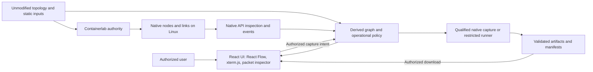
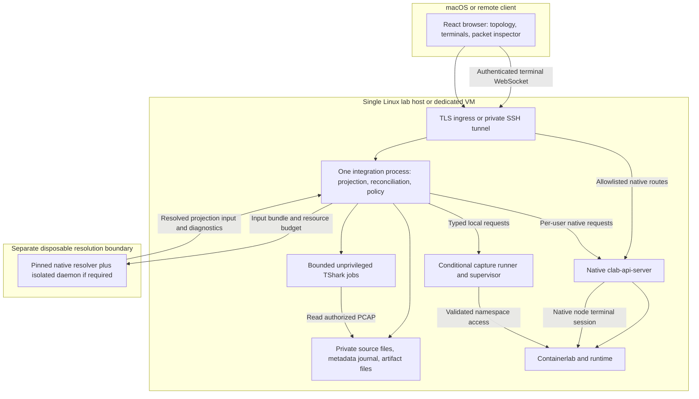
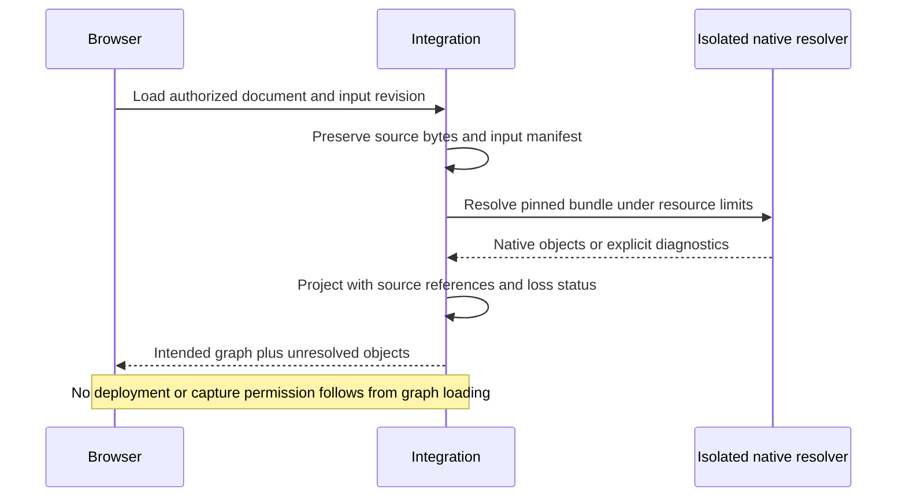
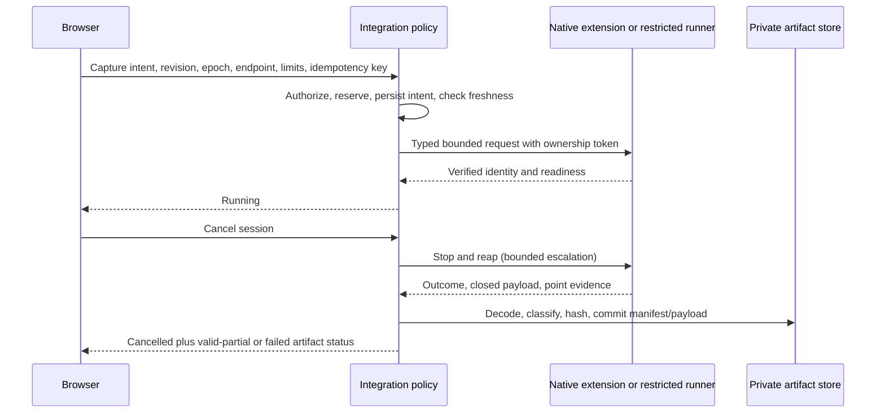

# Containerlab visualization and capture architecture

**A9 current implementation — Observed:** the local preview now supports 58 hash-verified recorded native fixture DTOs (`p1a/0.2`) alongside the synthetic profile. Single-ended links render without a fabricated peer; native aliases, occurrence identity and unresolved source provenance are explicit. 21 contract tests, TypeScript/build and 10 Chromium tests pass. [Evidence](../implementation/A9/RESULTS.md). This is recorded-result projection, not live resolution or source ingestion. TT-01 still excludes R2/R3 authorization; historical Q scores remain unchanged.

**A8 active scope — user-selected TT-01:** trusted single-user test environment. R2 caller/job authorization, R3 identity/ownership integration and P6 multi-user work are **OUT_OF_SCOPE**, not passed or prerequisites. This supersedes authorization requirements and next-step recommendations in earlier sections below. Retain native correctness, containment, limits, data minimization and metadata compatibility/expiry. See [test profile](TEST_PROFILE.md). **Observed:** [EXP-013](../../experiments/EXP-013-context-coverage/RESULTS.md) resolved 25/26 context derivatives versus 0/26 original fragments and confirmed a one-ended dummy link. New VM stopped; historical Q scores unchanged.

Architecture revision A4 · evidence baseline: qualification run 03 · **proposed, not implemented**.

**A3 inherited security baseline:** incorporates the updated [architecture brief](../../../containerlab-investigation/ARCHITECTURE_PROMPT.md) without changing investigation evidence. Sensitive-data policy, browser-content policy and document publication are proposed requirements, not tested safeguards. [D-13–D-15](DECISIONS.md) and [A3 acceptance tests](IMPLEMENTATION_PLAN.md#a3-security-and-publication-acceptance) define closure. The investigation remains read-only; [A2 snapshot](history/A2-before-A3/MANIFEST.json) preserves the prior set and prompt.


**Inferred recommendation:** retain native Containerlab topology and lifecycle; use a React client with a read-only React Flow topology view, separately authorized xterm.js node terminals and TShark-backed packet inspection with one Linux integration process for source provenance, graph projection, observation reconciliation and artifact policy. Reuse native authentication/inspection/capture facilities wherever their contracts satisfy the gates. Isolate native resolution from the operational host. Add a restricted capture runner only if an upstream extension cannot meet freshness, limits and recovery requirements. These are logical responsibilities, not a prescribed fleet of services.

Version alignment, complete export/provenance and capture ownership/recovery are conditional decisions. [Decision records](DECISIONS.md), [traceability](TRACEABILITY.md) and [implementation handoff](IMPLEMENTATION_PLAN.md) define their alternatives and closure tests. The [previous proposal](../../../containerlab-investigation/artifacts/design/history/pre-architecture-phase/ARCHITECTURE.md) is preserved as historical text; conflicting statements there are superseded here.

## A4 preparation outcome

**Documented:** [CP-01](CANDIDATE_PROFILE.json) selects the already pinned API source `7376ab9fcc0d8aa099102f52e373c8ee6f0869b6` with embedded native v0.79.0; its Go directive is 1.27.1. **Inferred:** this is the preferred aligned build candidate, not a built or accepted runtime profile. Historical v0.6.0/v0.78.0 operational evidence remains separate.

**Inferred decisions:** prefer a minimal native-library resolver if public export fails the independent contract; first assess upstream component reuse behind a safe DTO boundary rather than adopt the raw-YAML/editor host unchanged. Prefer the existing upstream per-user login-session pattern with native resource reauthorization, subject to R3 tests; no supported introspection interface is assumed. R1–R4 remain open for runtime acceptance.

[Readiness findings](READINESS.md) cite pinned sources and the static audit. [P1a contract](P1A_CONTRACT.md), [backlog](P1A_BACKLOG.md), [qualification plan](RUNTIME_QUALIFICATION_PLAN.md) and [brief](READINESS_BRIEF.md) make the next scope concrete. Only static probes and document/fixture validation were executed; no application code or runtime work was performed. The historical Q and all S statuses remain unchanged.

## 1. Evidence and scope

**Observed, F-022–F-027:** qualification demonstrated inherited native configuration and aliases, template expansion, API lifecycle/ownership/inspection, a supported GUI graph, Linux-veth capture controls/faults/concurrency, Packetflix streaming/VNC readiness and one SR Linux alias/port inspection. Resolution retrieved an HTTP startup configuration; a VNC capture survived API restart without a retrievable session; quota exhaustion corrupted a PCAP despite exit 0. [Qualification report](../../../containerlab-investigation/QUALIFICATION.md), [loss ledger](../../../containerlab-investigation/artifacts/qualification/LOSS_LEDGER.md), [capture failure](../../../containerlab-investigation/artifacts/qualification/capture-results.json), [restart evidence](../../../containerlab-investigation/artifacts/qualification/api-post-restart.json).

**Documented version boundaries:** resolver/CLI v0.79.0 at `5ae50094a3afd70e4e1674fe5385e64d8979da26`; tested API v0.6.0 at `bdbd2ecb97033b6ee65d580c968aee7ee90f15ff` embeds **v0.78.0**. Tested GUI v0.2.2 at `31727ea16c915004319cfe70cdec3e1032ad68a9` locks clab-ui 0.3.1 with XYFlow. These are separate evidence profiles, not an accepted combined production stack. [Source index](../../../containerlab-investigation/artifacts/sources.csv), [reuse matrix](../../../containerlab-investigation/artifacts/qualification/REUSE_MATRIX.md).

**Observed corpus:** 435 candidates, 177 included, 258 excluded; 123 native validation PASS/54 FAIL; 177 semantic projection/render PARTIAL; 0 complete static passes. Every corpus runtime stage remains NOT_RUN. Synthetic lab results do not change those rows. [Manifest](../../../containerlab-investigation/artifacts/corpus/manifest.csv), [stage results](../../../containerlab-investigation/artifacts/compatibility/results.csv).

**Inferred/proposed scope:** all native kinds remain representable, with unknown/unresolved attributes recoverable from authorized source. Initial operational qualification targets Linux/Docker veth capture and the demonstrated SRL inspection path. Other NOS, guests, Podman, shared/tunnel links and dense/live graph performance remain explicit gates. Static universal acceptance is still required; a limited preview cannot satisfy it. No topology editor, custom switching, competing DSL or deployment engine is proposed. Native topology-defined OVS/OVN nodes remain legitimate inputs.

All design statements below are **Inferred/proposed** unless explicitly marked Observed, Documented or Unresolved. They are acceptance obligations, not implemented guarantees.

## 2. Context and deployment





The browser has no runtime socket, arbitrary namespace access or privileged credentials. The native API retains its existing privilege requirements; placing an unprivileged integration process in front does not make the API least-privileged. Allowlist exposed native operations to topology inspection and separately authorized node-terminal sessions; deployment remains native and can be invoked through existing authorized tooling. Do not add duplicate lifecycle routes.

The integration process does not retain native login passwords and obtains authenticated identity through a qualified native authentication bridge (D-04). Proxying is permitted only with the user's native credentials/session, not an unrestricted administrative identity. Authorization failure or inability to verify identity disables the operation. Do not expose Edgeshark discovery/capture ports directly to an untrusted browser; a scoped authenticated transport is a prerequisite for enabling live capture beyond private experiments.

The resolver receives immutable copied inputs, a private writable scratch area and default-denied outbound access. Its daemon, if required, belongs inside the disposable boundary: a supposedly read-only mount of a privileged operational Docker socket is not isolation. Native resolution may have effects even without Deploy. Do not rewrite topology paths silently; preserve bundle-relative layout and record unsupported absolute/context-dependent dependencies as diagnostics. A reviewed, pinned download can be staged explicitly; the resolver cannot fetch arbitrary dependencies on the operational host. Full isolation feasibility remains D-02/B2, not a measured guarantee.

## 3. Responsibilities and state

| Responsibility | Placement and reuse | Why it exists / boundary |
|---|---|---|
| Topology semantics and lifecycle | Native Containerlab, selected aligned version profile | Sole authority; no custom default merging, alias conversion, Go-template evaluator or network rewiring |
| Authentication and lab ownership | Native API/auth integration | Reuse tested PAM/JWT/ownership paths; added routes must inherit verified identity and reauthorize, not trust a client username |
| Source/provenance and graph | Modules in one integration process | Original bytes and native objects are distinct; React Flow needs a projection and diagnostics |
| Runtime observation | Same process, native inspect/events inputs | Events lack a qualified atomic cursor; explicit freshness and resync needed |
| Capture/artifact policy | Same process, conditional upstream extension first | Authorization, quotas, durable session ownership and artifact acceptance are gaps, not a second deployment service |
| Privileged capture execution | Upstream facility if qualified; otherwise one narrow local runner | Bounded child/cgroup, validated namespace/interface, fixed argv; no shell/program/path supplied by client |
| Durable metadata | Initially one local transactional journal, proposed SQLite | Atomic reservation/idempotency/recovery records; no separate database server or broker justified by current scale evidence |
| Payload storage | Private local files on quota-controlled storage | Source bundles and PCAPs require access control, size limits and atomic publication; no object-storage service needed initially |

If upstream capture gains durable ownership and artifacts, reuse that storage rather than create parallel session truth. The journal proposal is conditional on D-06/D-07. Store source revision/input hashes, ownership references, authorization audit, mapping observations, session lifecycle, runner ownership token and artifact manifest. Do not store native login passwords or unrestricted runtime credentials in the journal. Resolved topology values may contain node credentials and require the restricted storage policy in section 9. Never log raw sensitive payloads. Cache graph and runtime observations separately; rebuild derived graphs from source/native inputs.

Single-host/single-writer operation is the initial assumption. Multi-host and high availability would require revisiting fencing, identity and storage; they are not implied by this design. On disk exhaustion refuse new reservations, retain terminal diagnostics where possible and stop bounded children; journal capacity and artifact quota need separate headroom.

## 4. Source and graph contract

| Field/concept | Proposed meaning |
|---|---|
| `documentId` | Opaque identifier for an authorized source location; not a filesystem path from the browser |
| `revision` | Hash of original bytes, input manifest and resolver profile; excludes synthesized MACs and runtime timestamps |
| `inputManifest` | Original locations, relative paths, hashes, template vars/includes and explicit missing dependencies; secret values stay private |
| `resolution` | Complete/partial/rejected, diagnostics, resolver pin, source/native references and loss ledger; successful validation alone is insufficient |
| `objectId` | Revision-scoped node key or source link occurrence; parallel links remain distinct |
| `origin` | Source file/hash/pointer or template input reference, with origin status known/unresolved; do not infer exact inherited origin by duplicating native semantics |
| `attributes` | Authorized projection of source and native values with explicit differences; sensitive values referenced/redacted rather than broadcast |
| `logicalRole` / `nativeType` | Separate source semantics from native mechanism, e.g. management attachment versus veth |
| `endpoint` | Source token, native alias, normalized name, native endpoint object and separately observed runtime mapping |
| `capability` | Supported/unsupported/unresolved/stale/denied, reason, version scope and evidence/observation age |

A revision-scoped ID is deterministic within the same input bundle. Array reorder or template expansion changes can invalidate cross-revision link identity. Do not inject GUI IDs into YAML or merge indistinguishable parallel occurrences. Preserve an unresolved template source reference when native output lacks expansion coordinates. Generated MACs remain native output, never a source identity key ([repeat experiment](../../../containerlab-investigation/artifacts/qualification/resolution-repeat.json)).

Example **proposed graph fragment**, not a native API response:

```json
{
  "contract": "proposed/1",
  "documentId": "doc-42",
  "revision": "sha256:input-bundle-and-resolver-profile",
  "resolution": "partial",
  "link": {
    "id": "revision/link/0",
    "sourceRef": {"pointer": "/topology/links/0", "origin": "known"},
    "logicalRole": "point-to-point",
    "nativeType": "veth",
    "endpoints": [
      {"node": "srl", "sourceToken": "ethernet-1/1", "nativeAlias": "ethernet-1/1", "normalizedName": "e1-1"},
      {"node": "peer", "sourceToken": "eth1", "normalizedName": "eth1"}
    ],
    "capture": {"status": "unresolved", "reason": "NOS_CAPTURE_NOT_QUALIFIED"}
  }
}
```

Keep disconnected nodes, parallel links and native component membership. A native bridge node remains a node; host interfaces, management segments and remote tunnel termination are explicitly derived/external entities. A dummy endpoint cannot imply a reachable peer; a tunnel's destination metadata is not proof of guest connectivity. Unresolved source-backed pairs may render with diagnostics but must not masquerade as native-resolved connectivity.

Node/edge inspectors show source, native and observed values in separate sections, with origin and capability reasons. Use selection/panels for dense endpoint labels; count retention and a successful canvas load cannot qualify readability or attributes ([visual QA](../../../containerlab-investigation/artifacts/qualification/render/VISUAL_QA.md)). Source remains available when resolution fails, under source authorization; no proprietary image/license is required simply to include/display a source case.



## 5. Observations, identity and consistency

Reuse native inspect/interfaces and NDJSON events. **Observed:** `initialState=true` supplied snapshots; tested events exposed timestamps/actor identity, not a qualified atomic cursor ([events](../../../containerlab-investigation/artifacts/qualification/events-snapshot-initial.ndjson)). Do not fabricate native ordering by sorting timestamps.

Proposed reconciliation: subscribe/buffer native events, collect inspect/interface snapshots, reconcile buffered events as hints, and inspect changed objects again. Publish an observation version with collection interval and freshness status. If a boundary cannot be reconciled, publish uncertain/stale state, not an atomic snapshot claim. Bound the queue; overflow, reconnect, server restart or authentication loss invalidates freshness and triggers full reconciliation. Periodic inspection covers missed events even without an explicit gap signal. Coalesce counters only; reconcile lifecycle/session state independently.

`observationEpoch` is a local host/application epoch changed on boot, process restart, detected deployment change or loss of continuity. `sequence` orders only this integration process's published observations; it is not a native event cursor. Keep source `revision`, per-lab deployment identity and observation epoch separate. A disconnected browser receives a fresh snapshot; durable event replay and a message broker are unnecessary initially.

```mermaid
sequenceDiagram
  participant Native as Native API and runtime
  participant App as Integration
  participant UI as Browser
  Native-->>App: Event disconnect or redeploy evidence
  App->>App: Invalidate mapping and change observation epoch
  App-->>UI: Stale state; capture unavailable
  App->>Native: Reconnect events and collect fresh inspection
  Native-->>App: Snapshot and interface identities
  App->>App: Reconcile buffered hints and inspect changes again
  App-->>UI: New snapshot with freshness and capabilities
  Note over App,UI: Uncertain collection interval stays explicit
```

A capture point binds lab ownership, source revision, native node/container ID and started-at, host boot ID, namespace handle/inode, interface name/index and qualified peer evidence. Revalidate authorization and identities immediately before capture opening; hold namespace handles during execution where feasible. Namespace inode reuse, container name reuse and interface index reuse are not proof of continuity (F-009/F-027).

**Unresolved:** an external native CLI or administrator can mutate a lab between validation and opening a capture. A local sequence alone does not close this race. D-06 requires a native lifecycle fence or demonstrated equivalent binding/revalidation and invalidation behavior. For cooperating callers a per-lab operation fence may serialize capture admission with native lifecycle requests without replacing their execution. Out-of-band mutations require detection and termination; never promise global atomicity across uncooperative changes. If the agreed freshness guarantee cannot be demonstrated, keep operational capture disabled.

## 6. Capture lifecycle and artifacts

State proposal: `requested → reserved → resolving → starting → running → stopping → finalizing → complete`. Explicit terminal alternatives are `cancelled`, `invalidated`, `interrupted`, `failed`, and `failed-corrupt`. Session outcome and artifact validity are separate fields; a cancelled session may contain a valid partial artifact.

1. Verify native identity and current lab/target ownership. Resolve only server-known edge/endpoint IDs; forbid browser-supplied namespace paths, arbitrary host interfaces, output paths or shell strings.
2. Atomically reserve per-user/global slots and private storage budget; persist idempotency key and request hash before spawning. Same key/body returns the prior request; a different body conflicts.
3. Resolve and revalidate the point under the qualified freshness mechanism. Validate BPF using tool compilation and fixed argv. Restrict shared/guest points until their visibility is qualified.
4. Persist ownership token and supervisor unit/child identity before exposing readiness. Runner enforces duration, packet and storage limits independently of client connection or integration-process survival. If supervisor ownership and journal cannot be reconciled, do not start.
5. Expose ready only after capture readiness is observed. Cancel with graceful stop, bounded escalation and confirmed reap. Record requested stop reason separately from exit/signal.
6. Close files; independently decode, inspect truncation, verify limit/provenance records and hash. Publish only after manifest and payload are durable, using an atomic rename on the same filesystem and a recoverable journal transition.



| Condition | Required interpretation |
|---|---|
| Expected duration/packet limit, clean close, decoder success, valid provenance | Complete, with stop reason and counters; zero packets can be a valid empty capture |
| User cancellation with decodable closed output | Cancelled; optional valid partial artifact, not an unqualified complete result |
| SIGKILL, service crash or mapping invalidation | Interrupted/invalidated, even if the decoder succeeds |
| Quota/write failure or truncated decode | Failed/failed-corrupt, even with process exit 0; no successful artifact publication |
| Hash matches transferred file | Byte integrity only; does not prove correct point, complete session or decodable payload |

Enforce total storage including rotated files and temporary outputs. Ring rotation is a retention policy, not a strict stop-at-byte promise. A strict byte-stop requirement needs a separately qualified writer/tool path; until then expose only measured bounds. Proposed initial policy: 30-second duration, 256-byte snaplen, 10 MiB per-session storage, two sessions per user and four per host, 24-hour retention. These are tunable policy candidates, not observed capacity or precision guarantees; B6/B7 must establish enforcement and disk headroom before adoption.

Store format, tool/image/resolver pins, original source revision, target identities, BPF/direction, requested/effective limits, readiness/start/stop times, exit/signal/reason, decoded counts, retained bytes, checksum and authorization owner in the manifest. Capture one endpoint by default; two-ended capture needs duplicate/provenance handling. Offload, encapsulation and guest dataplane visibility remain capability limits.

### Crash recovery and access

```mermaid
sequenceDiagram
  participant App as Restarting integration
  participant Journal as Durable session journal
  participant Supervisor as Runner supervisor/native sessions
  App->>Journal: Read nonterminal intents and ownership tokens
  App->>Supervisor: Inventory only service-owned children
  Supervisor-->>App: Exact child/unit/session identities
  App->>App: Match intent, ownership and deadline
  alt Verified owned survivor
    App->>Supervisor: Stop/reap by default; retain interrupted evidence
    App->>Journal: Persist terminal state after validation
  else Missing child or mismatched ownership
    App->>Journal: Mark interrupted/uncertain; block affected admission
    Note over App,Supervisor: Never kill an arbitrary name/PID match
  end
  App->>App: Reconcile storage reservations and permit admission
```

Supervisor-enforced deadlines must survive integration failure; restart scanning alone is insufficient if the process never restarts. Prefer terminating verified survivors rather than resuming capture across lost authority. For native VNC/Packetflix, do not enable unattended sessions until native durable ownership/cleanup or an equivalent narrow extension is qualified. Extending TTL does not repair lost session lookup. Closing a live browser transport and ending its capture are separate operations; require a bounded disconnect lease policy and verify actual cleanup. A supervisor cannot safely recover native children whose ownership is not provable.

Downloads use opaque artifact IDs, verified user identity, current lab permission and session/artifact ownership on every request. Source-read rights do not automatically grant capture rights. Range downloads bind to an immutable checksum/ETag; interrupted transport is a client download state, not a change to the stored artifact. Revocation blocks new requests and cancels active transfers under the selected policy; this behavior needs testing. Expiry/delete persist a tombstone, deny further reads, remove payload and release quota, then reconcile incomplete deletions after restart. Deny new capture on recovery uncertainty or storage failure.

## 7. Interface boundary

**Documented/Observed native reuse:** `/login`; `/api/v1/labs` and native lifecycle; `/api/v1/labs/{lab}/interfaces`; topology source routes; `/api/v1/events?initialState=true`; Packetflix and Wireshark VNC session routes. Exact tested behavior/version is in [API evidence](../../../containerlab-investigation/artifacts/qualification/api-results.json) and [lifecycle evidence](../../../containerlab-investigation/artifacts/qualification/api-lifecycle.json). Native errors may include 500 for invalid input; preserve upstream status and opaque correlation IDs, but map untrusted bodies through the safe diagnostic contract in section 9. Do not forward raw native errors or claim a new validation guarantee.

The following **proposed extension contract** is separate from native routes. Names are illustrative; settle the identity/ownership bridge before route implementation.

| Operation | Contract |
|---|---|
| `GET /integration/labs/{id}/graph` | Authorized source revision, intended graph, resolution diagnostics, observation epoch/sequence/freshness and capabilities |
| `GET /integration/labs/{id}/objects/{id}` | Authorized source/native/observed inspector values; sensitive attributes filtered |
| `GET /integration/labs/{id}/updates` | Initially snapshot polling with ETag; optional SSE for invalidation/session notifications after B5, always resync on reconnect |
| `POST /integration/labs/{id}/captures` | Opaque endpoint, expected revision/epoch/observation version, bounded limits, filter and idempotency key; accepted means reserved, not ready |
| `GET /integration/captures/{id}` | Owned session state, observed readiness, effective limits and artifact validity |
| `DELETE /integration/captures/{id}` | Idempotent cancellation request; terminal result only after confirmed stop/finalization |
| `GET /integration/artifacts/{id}` | Reauthorized immutable download with size/type/checksum/ETag and qualified range semantics |
| `DELETE /integration/artifacts/{id}` | Authorized deletion/tombstone with active-read behavior specified |

For graph observations, prefer request/response plus polling first; no custom graph WebSocket protocol or replay infrastructure is justified by current measurements. Interactive terminals separately reuse the native bidirectional WebSocket transport after qualification. Native NDJSON is an input stream, not this extension protocol. Suggested extension errors: 401 unauthenticated, 403 denied, 404 absent/concealed resource, 409 stale revision/identity or idempotency conflict, 422 unresolved/unsupported point or invalid filter, 429 concurrency/storage reservation quota, 503 unavailable runtime/recovery. Define non-disclosing responses consistently with native ownership tests. An error response never silently switches interface or weakens requested bounds.


## Frontend and packet-analysis contracts

**User-selected requirement:** React for the application, React Flow for topology visualization, xterm.js for node terminals, and TShark for packet analysis feeding React views. This supersedes the Cytoscape constraint in the original brief and A1, preserved in [the A1 archive](../../../containerlab-investigation/artifacts/design/history/A1/ARCHITECTURE.md). Topology editing remains out of scope; interactive terminals can change node configuration and therefore have a distinct permission. The application as a whole is no longer described as read-only.

**Documented:** the pinned upstream GUI already declares React, xterm.js and React Flow/XYFlow dependencies ([package lock](https://github.com/srl-labs/containerlab-app/blob/31727ea16c915004319cfe70cdec3e1032ad68a9/package-lock.json)). The pinned API exposes node terminal creation, session retrieval/deletion and a WebSocket stream ([routes](https://github.com/srl-labs/clab-api-server/blob/bdbd2ecb97033b6ee65d580c968aee7ee90f15ff/internal/api/routes.go)). These are source findings, not terminal runtime qualification.

**Inferred recommendation:** evaluate adopting/extending that upstream frontend before building a new React application. The old renderer exclusion is removed; full semantic fidelity, source preservation, permissions and supported extension boundaries still determine fit. Avoid a fork unless specific unmet requirements justify its maintenance. Keep graph/analysis/policy contracts independent of upstream UI internals. Select exact frontend/TShark versions during qualification; the historical lock is evidence, not automatic approval of a new production stack.

### React Flow projection

Map native nodes to React Flow custom nodes and each visualized interface to an explicitly identified handle. Edge occurrence IDs and source/target handle IDs refer back to semantic endpoint IDs; renderer positions, handles and selection never become topology authority. Source/target attachment does not make a bidirectional network link semantically directed. Preserve parallel occurrences, special endpoints, component membership and disconnected nodes. Disable connection creation/reconnection and topology edits; layout movement is view state only.

The source/native/runtime inspectors remain React panels. Qualify layout integration, dense labels, selection, accessibility, updates and 10/50/100/500-node workloads on React Flow. **Historical evidence:** the 177-case Cytoscape rendering results stay unchanged but do not qualify this renderer. A corpus-wide React Flow run is NOT_RUN; the previously observed small upstream GUI graph is only representative evidence. Native validation and capture results retain their original scope.

### xterm.js node terminals

Reuse native `POST /api/v1/labs/{lab}/nodes/{node}/terminal-sessions`, session GET/DELETE and `/api/v1/terminal-sessions/{sessionId}/stream` WebSocket rather than inventing a PTY service. xterm.js supplies terminal rendering/input; Linux/native facilities own process execution and connectivity. Authorization must bind verified user, lab, node, deployment identity and session on creation and attachment; a session ID alone is not authorization. The browser supplies a selected node, never an arbitrary host shell command or namespace path.

Define separate inspect, terminal and capture permissions. Hide/deny terminals until their native transport and permission bridge are qualified. Bound concurrent sessions and output buffering, propagate resize, handle backpressure, and define idle expiry/disconnect grace and explicit termination. On restart/redeploy or lost ownership, invalidate the terminal and require a fresh authorized connection; do not silently attach to a replacement node. Verify WebSocket origin/session checks, token expiry/revocation and native orphan cleanup. Treat terminal output as untrusted, restrict link/clipboard handling, and avoid logging commands/output that may contain credentials. A terminal is not a read-only shell, and UI controls cannot prevent its authorized user from changing node state.

### TShark-backed packet inspector

TShark runs as a bounded Linux child job, not in the browser and not as the GUI itself. Prefer capture to a validated stored PCAP/PCAPNG first, then analyze it without capture privileges. Reuse TShark decoding capabilities; build only the React packet list, packet details/protocol tree, byte view and filtering/query boundary that the selected upstream UI does not provide. Full desktop Wireshark feature parity is not assumed. Live analysis is a later separately qualified path; VNC/Wireshark remains optional and is not required for the initial stored-packet inspector.

Requests identify an authorized opaque artifact ID, requested field set, display filter and bounded result window. Distinguish capture BPF from TShark display-filter syntax; do not pass arbitrary command options, file paths, Lua scripts or shell strings from the client. Decode untrusted packets in restricted processes with CPU/memory/time/output budgets, no runtime socket and no unnecessary network/filesystem access. Native output formats/flags must be checked against the pinned TShark version. Normalize structured output into a versioned UI contract; preserve packet number, artifact checksum and dissection profile so query results remain traceable to immutable bytes.

Use summary fields for the virtualized packet list and request expanded protocol/byte details only for selected packets. TShark structured output alone does not supply indexed paging: qualify bounded scans versus a derived index/cache keyed by artifact hash, TShark version, dissector profile and filter. Cap query/result size, cancel work on expiry, and reauthorize queries/details/downloads. Analyze deletion/revocation races; cached results inherit artifact permissions and retention. Analysis failure/timeout is distinct from capture failure and cannot rewrite the original artifact outcome. Packet payloads and protocol text are untrusted UI content.

Proposed extension operations: `POST /integration/artifacts/{id}/analysis` for a bounded query, `GET /integration/analysis/{id}` for status/results, `DELETE /integration/analysis/{id}` for cancellation, and an authorized packet-detail operation keyed by artifact/packet number/profile. These are design examples, not native routes. Existing native terminal endpoints remain separately identified; no duplicate terminal lifecycle API is assumed necessary.

**Qualification impact:** D-03 is superseded; D-04/D-05/D-07/D-10 gain identity, transport, analysis and privilege obligations, and D-11/D-12 cover terminals/analysis. B4 must first assess upstream reuse and rerun renderer acceptance; B5 adds terminal lifecycle/security; B7 adds analysis accuracy/resource/access tests. Existing Q outcomes remain historical run-03 results and are not promoted. Native authority, version alignment, export provenance, capture freshness and crash recovery requirements remain unchanged.

## 8. Acceptance and delivery

The design mitigates Q-02–Q-06 but does not promote them. **Observed baseline remains 3 PASS / 4 PARTIAL / 1 FAIL** ([acceptance](../../../containerlab-investigation/docs/QUALIFICATION_ACCEPTANCE.md)). The 54 validation failures require per-case classification: source invalidity (e.g. C088), missing context, environment dependency or another diagnosed issue. Projection omissions and readability are separate failures even for native-valid cases. Original inputs and canonical aliases stay in the denominator; corrected fixtures cannot replace original failures.

[Implementation plan](IMPLEMENTATION_PLAN.md) separates decision blockers, enablement tests and later expansion. No new runtime experiment was needed to produce this conditional architecture; no VM was accessed or changed in this phase. No production code was built.

Recommendation: reuse native lifecycle/auth/inspection, isolate native semantic resolution, and build the required read-only projection. Resolve D-01/D-02/D-04 before committing to operational integration; settle D-06/D-07 before capture implementation. Qualify upstream frontend reuse (D-03), native terminals (D-11) and packet analysis (D-12) before enabling their workflows. Proposed Phase 1 then proceeds through source/graph, observations and narrowly qualified capture/artifacts, with B1–B7 validation gates. Full static support remains a separate mandatory unmet gate; broader capture follows B8.


## 9. Sensitive configuration and data lifecycle — D-13

**Documented evidence:** the [loss ledger](../../../containerlab-investigation/artifacts/qualification/LOSS_LEDGER.md) records resolved credentials; F-022/F-023 distinguish native objects from sanitized evidence. **Inferred/proposed policy:** classify source bytes, static inputs, full resolved objects, packet payloads/dissections and terminal streams as restricted by default. Authorization to inspect a graph does not authorize reading all configuration or executing a terminal command.

| Data boundary | Required contract |
|---|---|
| Source/input store | Preserve exact original bytes and unknown attributes in access-controlled, encrypted private storage; retain ownership and revision references. Redaction affects derived views, never authoritative input. |
| Resolver boundary | Pass only authorized copied bundles; keep output and scratch inside the isolated encrypted boundary. Native stdout/stderr is restricted input, not application logging. No operational runtime socket. |
| Browser projection | Construct an explicit versioned DTO with object IDs, endpoint references, capability states and reviewed display fields. Default-deny arbitrary metadata, native NodeConfig and unknown fields. Allowlisted text remains untrusted and potentially sensitive; apply field-specific redaction and size limits. |
| Source/secret disclosure | Source-read and secret-reveal are separate permissions from graph inspection. Initial preview exposes sanitized views only. A raw-source download/reveal stays disabled until current authorization, no-store responses, safe download handling and value-free audit pass. Do not imply redaction grants access. |
| Logs/errors/traces | Permit only opaque IDs, safe event codes, counts, statuses and timings. Exclude bodies, tokens, query/filter text, template variables, raw diagnostics, commands, terminal streams and dissections. Map upstream errors to reviewed messages; never echo rejected input. |
| Audit | Record verified subject reference, resource ID, action, outcome and time; exclude disclosed values, user-supplied labels and payloads. Protect the audit store and apply finite retention. |

No generic serialization of native objects reaches the frontend. Projection failures return an opaque diagnostic reference and safe reason, not a raw fallback. Unknown values remain recoverable in restricted originals; a redacted marker preserves field presence where safe. Approved display fields require both schema review and data-disclosure review; secret-name matching alone is insufficient. Reauthorization applies to cached views, details, downloads and active sensitive streams. Clearing a browser view cannot retract bytes already received; no such guarantee is claimed.

### Encryption, keys and storage placement

Require TLS for browser HTTP/WebSocket and network service hops carrying sensitive data, or an explicitly configured private SSH tunnel with protected local endpoints for a development profile. Local IPC uses private sockets/process permissions; it is not described as encrypted transport. Configure trusted origins and certificates explicitly, fail closed on verification errors, and do not place credentials in URLs.

All persistent sensitive stores, journal side files, resolver scratch, temporary downloads, analysis caches and backups must reside on approved encrypted storage. Prefer deployment-managed encrypted volumes and existing OS secret facilities over a new secrets service. macOS host encryption alone is not evidence that a remote Linux volume or backup is encrypted. Document the exact host/guest volume coverage and verify it before enabling persistence. Disable sensitive crash dumps and unencrypted swap paths or include them in the verified encrypted boundary.

The deployment operator owns key provisioning, rotation and recovery; application code receives only the access it needs. Keep keys outside repositories, payload directories and backup bundles; restrict service identities and never use a shared global admin credential as the identity bridge. The selected deployment profile must record key location, authorized principals, rotation/recovery procedure and backup protection. If encryption or required keys are unavailable, refuse sensitive writes rather than fall back to plaintext. Volume encryption does not replace per-user authorization or protect against a compromised authorized running process. Exact key-provider integration is **Unresolved enablement work** under B1/B2/B7, not a reason to add a new service now.

### Retention, deletion and crash cleanup

**Proposed initial policy, not measured:** require explicit finite retention settings at installation; omit no data class silently. An unconfigured sensitive store cannot be enabled. Immutable revisions prevent modification, not expiry. The capture duration/storage defaults in section 6 remain candidates and do not supply source or audit retention settings.

| Class | Lifetime and deletion rule |
|---|---|
| Originals and revisions | Owner-approved finite retention; delete through an authorized tombstone, invalidate projections and deny new reads before removing bytes. Keep only nonsecret audit/provenance needed by explicit policy; dependent references become unavailable, never silently repointed. |
| Resolver scratch/full outputs | Delete after result projection or failure; recover abandoned job directories at startup using verified job ownership. Impose a bounded job lifetime and encrypted scratch quota. |
| Graph/analysis caches | Never outlive source/artifact permission or expiry. Key by revision/profile and authorization scope; cancel readers/jobs and invalidate results on revocation/deletion. No persistent browser cache of sensitive content. |
| Captures, exports and download staging | Inherit artifact/source retention; interrupted exports are private and swept after bounded expiry. Cancel active reads before deletion under the tested policy. |
| Terminal buffers | Bounded memory during session only; no recording or browser persistence by default. Dispose on detach/expiry; never include streams in diagnostics. |
| Logs/audit | Finite independently configured retention; safe fields only. Purge rotation copies and support bundles under the same policy. |
| Backups | Disabled for sensitive payloads initially. Before enablement, require encryption, finite expiry and a deletion ledger applied before restored data can be served. State maximum residual retention; immediate physical removal from immutable backups is not promised. |

Deletion is a recoverable sequence: persist tombstone → revoke new access and cancel jobs/streams → remove owned payloads/derived data → reconcile quotas → record completion. Retry after crashes and deny reads while uncertain. Revocation may block access without deleting evidence; retention deletion removes the stored bytes. Do not promise secure erasure of SSD blocks or snapshots. Cryptographic erasure can be claimed only after demonstrating exclusive key scope and removal of all recovery copies. Acceptance: S-01–S-04 in the plan.

## 10. Browser content trust — D-14

**Inferred/proposed:** topology labels/metadata, native diagnostics, terminal bytes and packet dissections are untrusted even when an authorized user deployed the lab. Authorization is not HTML safety. React Flow custom nodes, handles, tooltips, inspector panels, packet trees, byte views and error panels must use text rendering with context-appropriate escaping. Do not use raw HTML, evaluated scripts, or data-driven style/attribute spreading. Exclude remote images/icons sourced from topology or packets; bundle approved assets.

Render arbitrary URLs as text by default. Initial topology and packet views do not activate content-derived links. If a later requirement enables them, allow only parsed HTTPS destinations under an explicit policy, require user action/confirmation, prevent opener access, and reject executable/custom/file/data schemes. Do not auto-navigate, fetch previews or resolve packet-derived hostnames from browser content.

### CSP and browser response policy

Proposed baseline: `default-src 'none'`; `script-src 'self'` with no eval or blanket inline scripts; `style-src-elem 'self'`; `connect-src` limited to the application and explicitly configured authenticated terminal WebSocket origin; `img-src 'self'`; `font-src 'self'`; `object-src 'none'`; `base-uri 'none'`; `frame-src 'none'`; `frame-ancestors 'none'`; `form-action 'self'`. Add nonces only for identified build requirements. Never reflect topology data into CSP.

**Unresolved pinned-frontend fit:** React Flow positioning and terminal styling may need controlled style attributes. B4 must test actual pinned builds and choose a narrowly scoped `style-src-attr` exception if required; do not relax script policy or the entire CSP. Worker/blob requirements likewise need specific justification and tests. VNC embedding stays disabled until a separately reviewed frame policy exists. CSP violations sent to logs must be sanitized because reports may contain sensitive URLs. CSP supplements safe rendering; it does not replace it.

Serve sensitive responses with no-store policy, accurate MIME type and no-sniff protection; downloads use attachment disposition and sanitized filenames. Store PCAPs/source exports outside static web roots. Do not serve untrusted artifacts as same-origin active documents. Avoid sensitive persistent browser storage and service-worker caching. Native terminal proxies must enforce origin and session authorization independently of CSP.

### Terminal and bounded rendering policy

Use the pinned xterm parser for approved display control sequences; register no output-driven browser or shell execution handlers. Disable OSC clipboard read/write and OSC hyperlink activation by default; remote titles/notifications are ignored or rendered as bounded text. Unknown controls do not gain custom handlers. Explicit user copy/paste is separate from remote clipboard control and requires the qualified terminal session; received output never automatically becomes input. If native/upstream handlers cannot be constrained, keep terminal capability disabled.

Define numeric budgets in the selected frontend profile before enablement: maximum field/detail response size, packet page size, terminal scrollback lines, queued output bytes, update rate and job response size. Enforce bounds at producer/transport and browser, not only after DOM creation. Overflow stops/cancels the affected stream or job with a safe visible reason; long display values may truncate with an explicit marker and an authorized bounded detail action. Preserve full authoritative bytes privately. No unbounded buffering to compensate for a slow browser; lifecycle events must trigger resync rather than silent loss. Test S-05–S-07 before enabling each surface.

## 11. Design publication and recovery — D-15

This workspace and `../../../containerlab-investigation` remain sibling directories. New design artifacts live here; the investigation and its scores remain read-only. The [flat A2 snapshot](history/A2-before-A3/MANIFEST.json) contains all five previous design documents, the exact updated prompt and the prior implementation handoff. Its manifest records original source paths and hashes without creating nested workspace copies. Archived links retain their original document context.

For later revisions: snapshot every current design artifact except history, the executing prompt and every external-to-design document being replaced. Preserve a manifest mapping archive names to source paths; reject collisions in a flat archive. Record absent expected files, snapshot identity and UTC time. Copy into staging, verify every hash against a stable source inventory, and atomically rename the complete snapshot directory on the same filesystem. Never overwrite a prior snapshot; any verification failure blocks replacement.

Stage the replacement set, validate links, decision references, gates and source hashes, and prepare an exact inventory of intended writes. Publish documents with per-file atomic renames; this does not make the whole revision atomic. Publish `COMPLETION.json` last, recording all delivered hashes, revision and predecessor snapshot. Readers accept a revision only if the marker and every hash match. A stale marker or mismatch means incomplete publication, not successful delivery.

After interruption, verify the snapshot first. Either finish installing the previously verified staged revision and revalidate it, or restore only replaced files from the archive and remove only manifest-listed newly created files; never touch unrelated work or the sibling investigation. Restore the old completion marker only when all old hashes match. For A4 rollback, restore the A3 design set and root handoff from `history/A3-before-A4`, and remove only manifest-listed new A4 deliverables; investigation A2 remains untouched. S-08 validates failure handling for future publication. Document verification is not application acceptance.

A4 preserves the complete predecessor in [A3 snapshot](history/A3-before-A4/MANIFEST.json), including its completion marker, handoff and this task’s executing brief. The current `COMPLETION.json` lists A4 files and static verification; archive hashes preserve A3 separately.

## A6 native resolution boundary refinement

**Observed:** EXP-011 found the pinned Docker Init requires runtime version information before parsing. The tested no-socket entry points cannot be the production resolver unchanged. **Inferred candidate:** retain Containerlab's library semantics behind an isolated, allowlisted projection with native occurrence indices, explicit source roles and separate alias/normalized fields. Do not use minimal export fallback as a successful result or forward raw native export. A synthetic ping/version stub established selected semantics only; no production proxy or fork is selected. Require a supported daemon-free initialization interface or qualified read-only information capability, real version data, broader kinds and template/effect checks before P4 enablement. Authorization/key custody/retention decisions remain P3 prerequisites.

## A7 runtime-information candidate

**Observed:** the unchanged pinned native Docker client can initialize selected fixtures through a finite version-information responder. A supervisor acquires actual daemon metadata before the job; the responder contains only five approved fields and cannot forward requests. **Inferred proposed boundary:** bind the immutable snapshot to native pin, daemon identity, job/owner and acquisition time; negotiate only an overlapping pinned client/server API, expire it, and deny all other operations. Never hand the worker the operational socket.

This is not an accepted production service or permission scheme. EXP-012 used an experiment-only 0666 socket to cross a user namespace and did not qualify peer identity. Production must establish per-job credentials/UID mapping or securely passed descriptors and cross-job denial. More kinds or native calls may invalidate this minimal candidate. No persistent metadata storage or new authentication system is selected.

## A8 trusted-test architecture and native projection

TT-01 overrides per-user/per-job authorization requirements in sections 9–10 and D-04 for the current project; those remain historical/future multi-user designs. A simple local metadata responder is sufficient, retaining a finite read-only field/route contract, actual version metadata and expiry. No caller binding, cross-job ownership checks or login subsystem is required. Do not mistake these scope exclusions for tested safeguards.

The next application boundary is an ephemeral native-fixture projection using pinned native getters. Store exact input bytes/hashes, retain occurrence identity, represent single-ended links explicitly and mark unproven source coordinates/inherited origins unresolved. The synthetic DTO is not silently repurposed as a native contract. Real daemon access remains in a trusted metadata collector outside the resolver. Operational actions remain disabled. Sensitive persistent storage is a separate feature and not implied by this slice.

## A9 implemented projection boundary

The local generator validates pinned EXP-013 input/result hashes and calls a typed projection over recorded native getter summaries. It emits only reviewed graph fields to bundled JSON; the browser validates a separate `p1a/0.2` recorded profile. The old synthetic schema remains unchanged. Native graph origin and source-token/field coordinates remain unresolved, with document hash and resolver/profile evidence kept separately. One-ended links are explicit node-attached markers plus inspectors, not fake peer nodes/edges. Native records with unsupported arity reject visibly instead of dropping objects.

There is no runtime service, source upload, daemon access or live resolution in this implementation. Connecting an isolated live fixture worker is the next separate step; it must preserve the same projection/limits and TT-01 scope.
