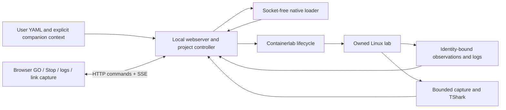

# Live installed application — proposed A34 target

**Documented/current:** React Flow rendering, native declaration projection, identity-bound observation, bounded logs and isolated capture/reanalysis exist. Catalog-based inputs, prerecorded frontend imports, experiment-only session validation and external deployment scripts prevent the desired installed workflow. A33 packaging proved portability, not deployment. See baseline.json for one preserved user-rebuild drift.

**Designed target:** user path → local project inventory → isolated native declaration loader → graph DTO → browser. GO → lifecycle controller → Containerlab in an owned Linux runtime → native enrollment → periodic bounded observation → SSE snapshots. Node logs and link capture use that same exact enrollment. Browser never receives a daemon socket or unrestricted native output. No database/broker is needed.

## Contracts

Project/1: launch path selects a single entry file; optional explicit companion paths are relative to its parent. No recursive directory copy, YAML reimplementation, automatic hook execution or remote fetching during load. Regular files only; reject symlink components, traversal, outside-root paths, special files, duplicates and oversize inputs. Hash exact bytes; snapshot selected files in memory and recheck before deployment. Missing context remains a native diagnostic. Environment/template context must be explicit; ambient process secrets are not inherited. Inventory is shown before GO. Internal legacy bundle IDs may identify content but never select packaged examples.

Lifecycle/1: no-project → loading → ready/not-deployed → deploying → running or partial/failed → stopping → stopped. Disconnected is distinct from destroyed. One mutation per owned project/runtime; duplicate GO refused. Persist ownership and operation intent before mutation. Match project hash, lab identity and full native IDs; same-name replacements require explicit re-enrollment. Before deploy, refuse an existing lab collision. Cancellation is bounded and cannot claim rollback completed unless cleanup is observed. Browser close never tears down the lab. Application restart reconciles intent and exact identities before enabling actions.

Events/1: SSE provides full current snapshots with monotonic generation/sequence, observation timestamps and freshness. Five-second bounded native polling initially; no observation overlap. On reconnect send full state, discard prior generation, cap each client queue and disconnect slow clients. Error/stale snapshots never become fresh healthy state. Browser selections clear on project/deployment change. Node/container readiness is not application health.

Capture link/1: request carries deployment ID + selected link ID and filename/settings; no user endpoint picker. For a qualified two-ended veth link, resolve a deterministic supported Linux endpoint using server-side native identity/namespace evidence, capture both directions there once, and retain chosen capture-point provenance internally. Parallel occurrences stay distinct. Other shapes/ambiguous associations are explicitly unavailable; never combine both ends silently. Reuse duration/bytes/snaplen/filter bounds. Store expiring artifacts with actual validated download filename; no arbitrary path writes or overwrite. Rotation/persistent retention unavailable until implemented. TShark reanalysis preserves original bytes/hash; only reviewed Lua IDs.

Runtime ownership: installed state outside app directory, owned immutable runtime ID/name/config/tool hashes; no experiment prefix or short lease. User-interaction runtime stays running until explicit stop. Qualification VM is fresh and stopped afterward. No old VM adoption. Mac loopback4173; no host mounts, forwarded agent or public ingress. Define quotas before live deployment. GUI removal cannot remove lab state.

## Dependencies

Mac app: bundled upstream Node26.8.1, built React19.2.8/React Flow12.10.2, Zod4.6.5; macOS ARM64 and browser. Host: Lima2.2.0/VZ. Linux: pinned Ubuntu image, Docker, Containerlab0.79.0 commit5ae50094a3afd70e4e1674fe5385e64d8979da26, compiled native declaration worker, Python3, bubblewrap, systemd, util-linux/nsenter, iproute2, coreutils/timeout, TShark/dumpcap and analysis-root shared libraries. Existing package lock controls JS closure; runtime APT/image closures must be inventoried during build. Go/C++/npm are build-only. Four-radio app image acquisition/build and pinned SR Linux image are separate user/test resources, never app payload. Signing/notarization remain unresolved; pkgbuild permission stderr needs investigation separate from payload validation.

## Dependency-ordered implementation and acceptance

1. Pure project inventory and link-target contracts with independent negative tests; extract reusable native projection from catalog loading.
2. Fixture-free production entry/server and package; empty-start and no-recording byte/content tests. Keep evidence UI exclusively in developer build.
3. Installed runtime artifact/bootstrap and owned lifecycle, then user-path native load. No repository/sibling requirement at launch.
4. GO/Stop native enrollment, SSE/reconnect, logs and link-level capture with actual artifacts.
5. Fresh installed runtime testing against pinned official demos plus unchanged four-radio source. Stage-level loading/rendering/deployment/observation/log/capture results; do not alter177 denominator. Broader unsupported demos remain inventoried.
6. Persistent user environment and interactive review after actual workflow acceptance. Material GUI changes require explicit approval; continue backend work while pending.

Independent acceptance: no packaged topology data; exact original file hashes; no symlink/traversal/implicit directory upload; late/changed identity refusal; serialized lifecycle; offline/reconnect states; literal hostile text; occupied port; no endpoint selector; filename corresponds to downloaded PCAP; unchanged bytes on reanalysis; clean native Stop. Installed execution from unrelated CWD with no developer tools or repository. Native loading and live demo tests cannot be replaced with mocks.
